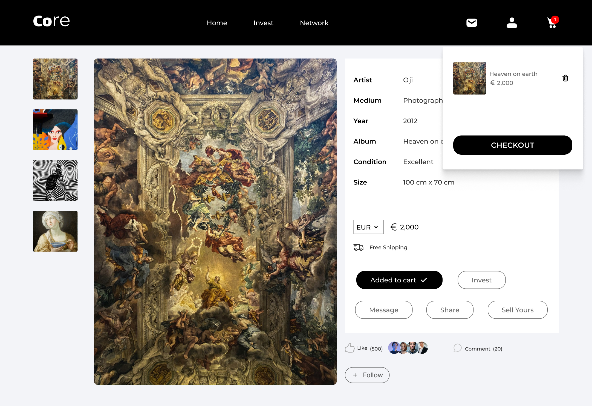

# Art Gallery Products Website

## Core [HNG Task 2]

This project is a responsive web application designed to showcase products from an art gallery. It features a hero section with a slideshow, product listings, and a checkout process.

## Table of Contents

- [Features](#features)
- [Technologies Used](#technologies-used)
- [Screenshots](#screenshots)

## Features

- **Hero Section:** Displays a slideshow of images with transition effects.
- **Product Listings:** Displays various artworks available for purchase.
- **Checkout Process:** Users can select artworks, add them to a cart, and proceed to checkout.
- **Responsive Design:** Ensures the website looks great on all screen sizes.

## Technologies Used

- React.js
- Tailwind CSS
- JavaScript (ES6+)
- HTML5
- CSS3

## Screenshots

